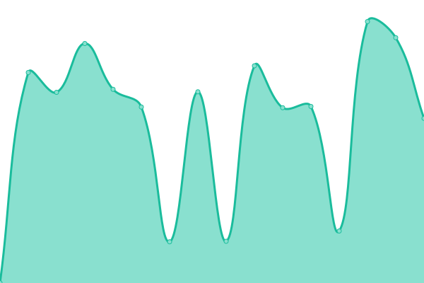
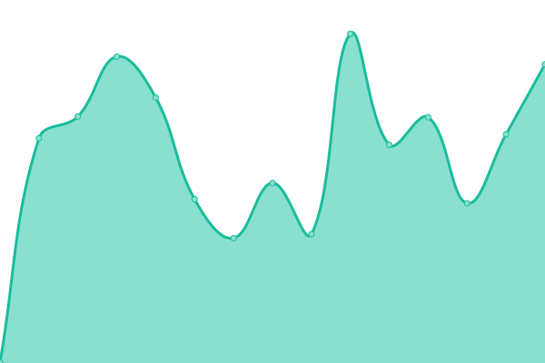
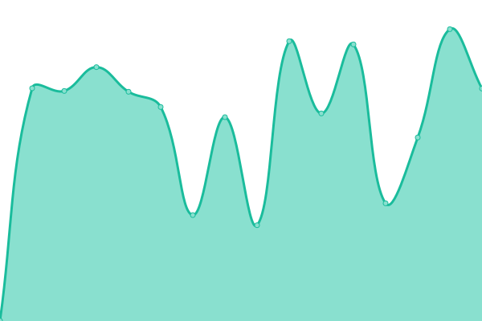
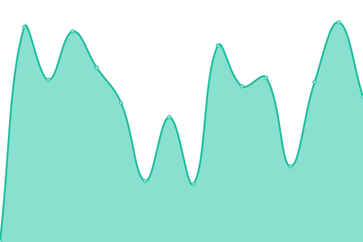

# [📈 Live Status](https://nanorocks.github.io/uptime-tool): <!--live status--> **🟥 Complete outage**

This repository contains the open-source uptime monitor and status page for [Andrej Nankov, MSc.](nankov.mk), powered by [Upptime](https://github.com/upptime/upptime).

With [Upptime](https://upptime.js.org), you can get your own unlimited and free uptime monitor and status page, powered entirely by a GitHub repository. We use [Issues](https://github.com/nanorocks/uptime-tool/issues) as incident reports, [Actions](https://github.com/nanorocks/uptime-tool/actions) as uptime monitors, and [Pages](https://nanorocks.github.io/uptime-tool) for the status page.

<!--start: status pages-->
<!-- This summary is generated by Upptime (https://github.com/upptime/upptime) -->
<!-- Do not edit this manually, your changes will be overwritten -->
<!-- prettier-ignore -->
| URL | Status | History | Response Time | Uptime |
| --- | ------ | ------- | ------------- | ------ |
|  [Deliciopz](https://deliciopz.com) | 🟥 Down | [deliciopz.yml](https://github.com/nanorocks/uptime-tool/commits/HEAD/history/deliciopz.yml) | 

 669ms
     
 | 

<a href="https://nanorocks.github.io/uptime-tool/history/deliciopz">97.53%</a>
    

|  [Delicio Beebistro](http://delicio.beebistro.mk) | 🟥 Down | [delicio-beebistro.yml](https://github.com/nanorocks/uptime-tool/commits/HEAD/history/delicio-beebistro.yml) | 

 892ms
     
 | 

<a href="https://nanorocks.github.io/uptime-tool/history/delicio-beebistro">97.55%</a>
    

|  [Beebistro](http://beebistro.mk) | 🟥 Down | [beebistro.yml](https://github.com/nanorocks/uptime-tool/commits/HEAD/history/beebistro.yml) | 

 898ms
     
 | 

<a href="https://nanorocks.github.io/uptime-tool/history/beebistro">97.56%</a>
    

|  [Beebistro Support](https://support.beebistro.mk) | 🟥 Down | [beebistro-support.yml](https://github.com/nanorocks/uptime-tool/commits/HEAD/history/beebistro-support.yml) | 

 595ms
     
 | 

<a href="https://nanorocks.github.io/uptime-tool/history/beebistro-support">97.59%</a>
    

|  [Nankov](http://nankov.mk) | 🟥 Down | [nankov.yml](https://github.com/nanorocks/uptime-tool/commits/HEAD/history/nankov.yml) | 

 1244ms
     
 | 

<a href="https://nanorocks.github.io/uptime-tool/history/nankov">97.61%</a>
    

|  [Velogs](https://velogs.app) | 🟥 Down | [velogs.yml](https://github.com/nanorocks/uptime-tool/commits/HEAD/history/velogs.yml) | 

 762ms
     
 | 

<a href="https://nanorocks.github.io/uptime-tool/history/velogs">97.62%</a>
    

|  [Velogs Test](https://test.velogs.app) | 🟥 Down | [velogs-test.yml](https://github.com/nanorocks/uptime-tool/commits/HEAD/history/velogs-test.yml) | 

 838ms
     
 | 

<a href="https://nanorocks.github.io/uptime-tool/history/velogs-test">97.64%</a>
    

<!--end: status pages-->

[**Visit our status website →**](https://nanorocks.github.io/uptime-tool)

## 📄 License

- Powered by: [Upptime](https://github.com/upptime/upptime)
- Code: [MIT](./LICENSE) © [Anand Chowdhary](https://anandchowdhary.com), supported by [Pabio](https://pabio.com)
- Data in the `./history` directory: [Open Database License](https://opendatacommons.org/licenses/odbl/1-0/)
